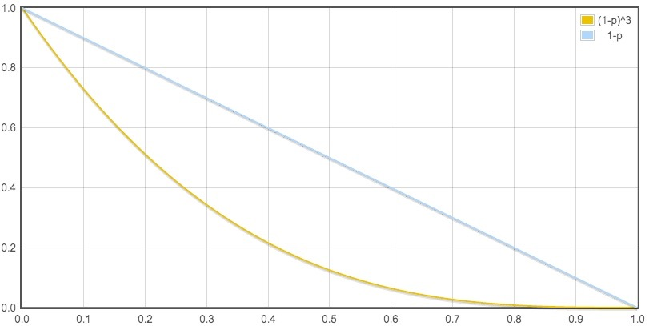
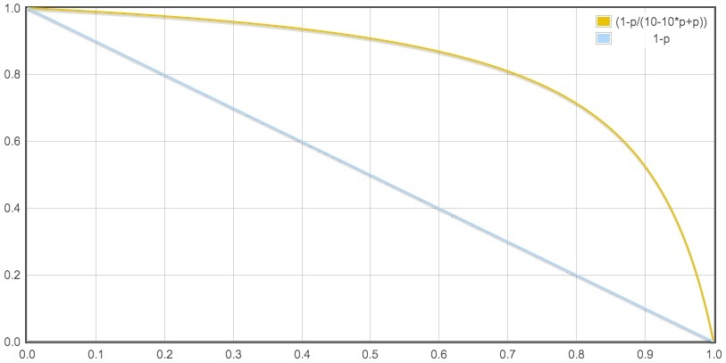
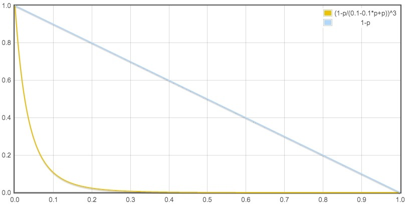
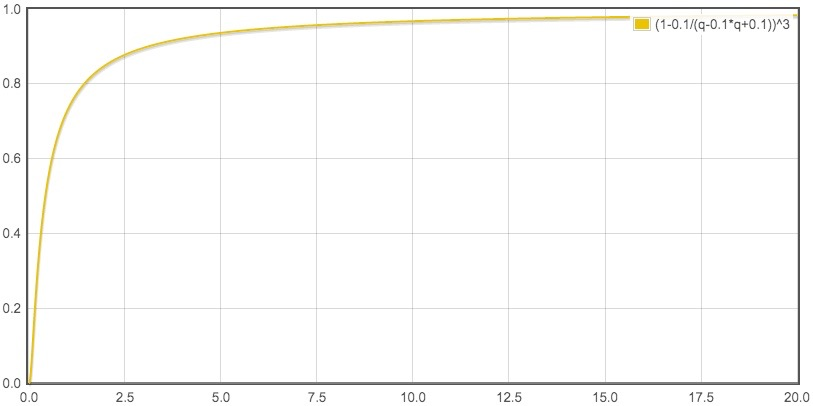

## w7
#### A
[1. Two Sum](https://leetcode.com/problems/two-sum/)

* 暴力：O(n^2)+O(1)
* 排序+二分查找：O(nlogn)+O(1)/O(logn)/O(n)
    * 题目要求返回下标，排序只能返回元素
* 一趟遍历hash：O(1n)+O(n)
    * 只需要往前找，第i个数只从[0,i)这些数里面配对，不需要考虑[i+1,n)，这个区间会随着i的递增遍历到）

```
vector<int> two_sum(vector<int>& nums, int target) {
    std::vector<int> result;
    std::sort(nums.begin(), nums.end());
    for (auto i = nums.begin(); i != nums.end(); ++i) {
        auto j = std::lower_bound(nums.begin(), nums.end(), target - *i);
        if (j != nums.end() && j != i && *j + *i == target) {
            result.push_back(i - nums.begin());
            result.push_back(j - nums.begin());
            break;
        }
    }
    return result;
}
```

#### R
[携程配置中心](https://github.com/pirDOL/kaka/blob/master/Industry/配置中心.md)

#### T
vue.js学习，准备今年的项目使用。一天学下来感觉和angular.js没啥大区别，都是html和js分离的思路，避免**jquery造成业务逻辑和控制dom耦合在js里面**。

快速入门视频：慕课网2倍速一上午就能看完

1. https://www.imooc.com/learn/935
1. https://www.imooc.com/learn/796

实践：把https://github.com/louie-001/table_vue这个例子改成了用webpack-simple实现，并则增加了vue-resource

## w8
#### A
timeline：

1. 18:35 开始
1. 47 RE：指针未判空
2. 49 WA：引用使用错误，改为二级指针
3. 56 AC

solution：加法器原理

>S = (A + B + C) % 10
>C = C / 10

clean code：

1. dummy head
2. 三个阶段可以合成一段代码：两个链表公共的部分加，单个较长的链表和进位加，最后进位加
3. 超过最长的链表的进位只会进一次

#### R
1. [分布式系统中负载均衡算法在高可用场景下的分析](http://tech.youzan.com/load-balancing-algorithm/)
1. [聊一聊一致性哈希](https://mp.weixin.qq.com/s/FgRi3aVpNYfaLU3EeVk7ug?)
2. [理解 Consistent Hashing](http://www.importnew.com/27909.html)


常用负载均衡算法：

1. 轮询
2. 随机
3. 加权：
    1. 响应时间：能较好地反应服务器的状态，但平均响应时间的计算滞后（下游副本多，上游qps又不高，那么响应时间的采样窗口就需要比较长，否则会因为采样点过少容易波动。然而窗口越长，滞后越厉害）
    1. 并发数：一个上游看到的当前时刻每个下游服务器正在处理的这个上游的请求数，能快速地反应服务器的当前状况（一个上游看下游的并发数并不能代表下游真正的并发数）
5. 哈希：取模或一致性哈希

注：响应时间和并发数都是一个上游看所有的下游。
模型：一个请求查询k次某服务，这个服务有n个副本，故障率为p，故障副本和正常副本的响应时间之比为q。上述各种负载均衡算法对请求的可用性对比（假设k=3, p=0.2, n=5, q=10和0.1）

|负载均衡算法|公式|可用性|
|-|-|-|
|轮询和随机|`(1-p)^k`，k越大可用性比(1-p)越小|51.2%|
|最小并发数|`(q*(1-p)/(1*p+q*(1-p)))^k`，q>1那么这个值就比(1-p)大，q<1这个值比(1-p)小|97.1%|





注：

1. 故障副本立即返回5xx（而不是触发上游超时）。此时故障副本的平响比正常副本小，即q<1，所以如果不对这种故障副本做特殊处理，会导致可用性降低。因此最小并发数需要配合故障副本连续失败次数超阈值熔断策略，防止q<1出现。
1. 故障副本触发上游超时，q=超时时间:平均响应=10，所以正常副本的连接数和故障副本的连接数比例就是10。n个副本中，`n*p`个故障的副本权重是1，`n*(1-p)`个正常的副本的权重是q。
2. 假设p固定，可以得到可用度和q的关系，它的作用是指导超时应该选择为平响的多少倍。根据下图给出的经验值是10倍。



#### T
1. xargs -P bash -c并发执行脚本，单双引号问题
2. rsync快速删除大量文件，比rm -rf快3倍
3. hadoop streaming基本概念，二进制日志上传hdfs不能用streaming统计

## w
#### A
[2. Add Two Numbers](https://leetcode.com/problems/add-two-numbers/)
#### R
#### T
