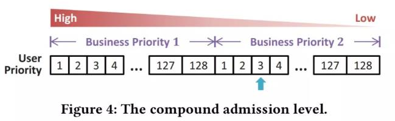
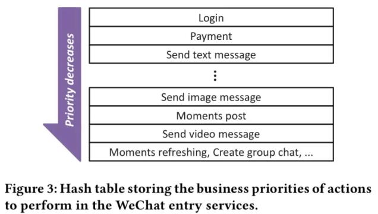
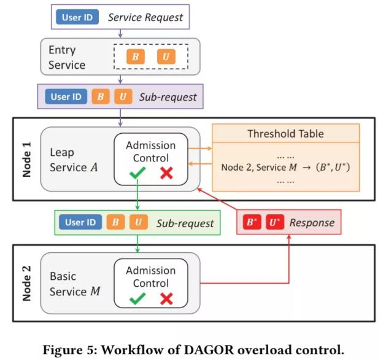
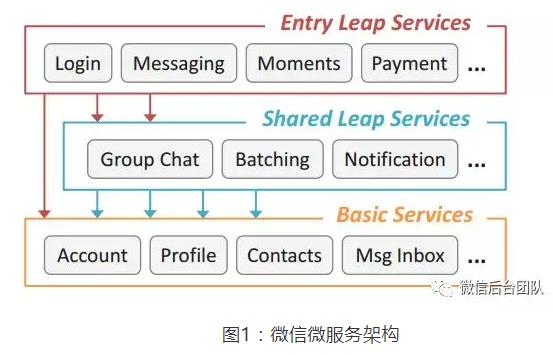

## q1总结
1. 完成度：
    1. A=2/6
    2. R=4/6
    3. T=6/6
2. 改进：坚持每周能完成ARTS中至少一项对于一个三分钟热度的人来说开了个好头，但是仍有许多地方需要改进：
    1. 规律作息周五不熬夜，周末下午才能不睡一下午
    2. 利用工作日的碎片时间完成review的学习，周末整理笔记
    3. 还是怕做算法题目

## w7
#### A
[1. Two Sum](https://leetcode.com/problems/two-sum/)

* 暴力：O(n^2)+O(1)
* 排序+二分查找：O(nlogn)+O(1)/O(logn)/O(n)
    * 题目要求返回下标，排序只能返回元素
* 一趟遍历hash：O(1n)+O(n)
    * 只需要往前找，第i个数只从[0,i)这些数里面配对，不需要考虑[i+1,n)，这个区间会随着i的递增遍历到）

```
vector<int> two_sum(vector<int>& nums, int target) {
    std::vector<int> result;
    std::sort(nums.begin(), nums.end());
    for (auto i = nums.begin(); i != nums.end(); ++i) {
        auto j = std::lower_bound(nums.begin(), nums.end(), target - *i);
        if (j != nums.end() && j != i && *j + *i == target) {
            result.push_back(i - nums.begin());
            result.push_back(j - nums.begin());
            break;
        }
    }
    return result;
}
```

#### R
[携程配置中心](https://github.com/pirDOL/kaka/blob/master/Industry/配置中心.md)

#### T
vue.js学习，准备今年的项目使用。一天学下来感觉和angular.js没啥大区别，都是html和js分离的思路，避免**jquery造成业务逻辑和控制dom耦合在js里面**。

快速入门视频：慕课网2倍速一上午就能看完

1. https://www.imooc.com/learn/935
1. https://www.imooc.com/learn/796

实践：把https://github.com/louie-001/table_vue这个例子改成了用webpack-simple实现，并则增加了vue-resource

## w8
#### A
timeline：

1. 18:35 开始
1. 47 RE：指针未判空
2. 49 WA：引用使用错误，改为二级指针
3. 56 AC

solution：加法器原理

>S = (A + B + C) % 10
>C = C / 10

clean code：

1. dummy head
2. 三个阶段可以合成一段代码：两个链表公共的部分加，单个较长的链表和进位加，最后进位加
3. 超过最长的链表的进位只会进一次

#### R
1. [分布式系统中负载均衡算法在高可用场景下的分析](http://tech.youzan.com/load-balancing-algorithm/)
1. [聊一聊一致性哈希](https://mp.weixin.qq.com/s/FgRi3aVpNYfaLU3EeVk7ug?)
2. [理解 Consistent Hashing](http://www.importnew.com/27909.html)


常用负载均衡算法：

1. 轮询
2. 随机
3. 加权：
    1. 响应时间：能较好地反应服务器的状态，但平均响应时间的计算滞后（下游副本多，上游qps又不高，那么响应时间的采样窗口就需要比较长，否则会因为采样点过少容易波动。然而窗口越长，滞后越厉害）
    1. 并发数：一个上游看到的当前时刻每个下游服务器正在处理的这个上游的请求数，能快速地反应服务器的当前状况（一个上游看下游的并发数并不能代表下游真正的并发数）
5. 哈希：取模或一致性哈希

注：响应时间和并发数都是一个上游看所有的下游。
模型：一个请求查询k次某服务，这个服务有n个副本，故障率为p，故障副本和正常副本的响应时间之比为q。上述各种负载均衡算法对请求的可用性对比（假设k=3, p=0.2, n=5, q=10和0.1）

|负载均衡算法|公式|可用性|
|-|-|-|
|轮询和随机|`(1-p)^k`，k越大可用性比(1-p)越小|51.2%|
|最小并发数|`(q*(1-p)/(1*p+q*(1-p)))^k`，q>1那么这个值就比(1-p)大，q<1这个值比(1-p)小|97.1%|


注：

1. 故障副本立即返回5xx（而不是触发上游超时）。此时故障副本的平响比正常副本小，即q<1，所以如果不对这种故障副本做特殊处理，会导致可用性降低。因此最小并发数需要配合故障副本连续失败次数超阈值熔断策略，防止q<1出现。
1. 故障副本触发上游超时，q=超时时间:平均响应=10，所以正常副本的连接数和故障副本的连接数比例就是10。n个副本中，`n*p`个故障的副本权重是1，`n*(1-p)`个正常的副本的权重是q。
2. 假设p固定，可以得到可用度和q的关系，它的作用是指导超时应该选择为平响的多少倍。根据下图给出的经验值是10倍。


#### T
1. xargs -P bash -c并发执行脚本，单双引号问题
2. rsync快速删除大量文件，比rm -rf快3倍
3. hadoop streaming基本概念，二进制日志上传hdfs不能用streaming统计

## w
#### A
[3. Longest Substring Without Repeating Characters](https://leetcode.com/problems/longest-substring-without-repeating-characters/)

#### R
1. [【SoCC2018论文】DAGOR：微信「大规模微服务过载控制系统」](https://mp.weixin.qq.com/s/uv4WkTIPvDCFlvKAEXrT2g)
1. [DAGOR：微信「微服务过载控制系统」（附论文）](https://mp.weixin.qq.com/s?__biz=MjM5MzM3NjM4MA==&mid=2654694647&idx=1&sn=75d0ba3fbcdb51fb55b121b98f6be9ce&chksm=bd583de48a2fb4f250d9954e8a727d9390a3cfea67b7fb257e3944a8a0787e1b942bc8e64099&scene=21#wechat_redirect)

问题和思考：

1. 为什么用排队时间而不用队列长度，文中没有论证。BIDU的做法是用定时扫描队列长度判断。队列长度和排队时间应该是位移和速度的关系，在排队论中二者应该差一个系数而已。其实本质是相同的。
2. 没有介绍过载如何恢复，因为限流是在上游模块进行的，而下游模块的优先级需要通过响应返回更新。如果下游模块过载很厉害，导致上游不往它发请求了，下游模块的优先级就没法更新了。
3. 算法的验证（选用队列时间判断过载以及DAGOR相比其他算法过载控制效果）使用的指标是服务可用性，这个想法很自然，但是也很有效。
4. 我觉得服务规模描述里面就流量、机器数有用，服务有多少种、每天多少次变更因为对服务和变更的描述不同而不可比，没啥参考性。
5. 整个算法是去中心化且自适应的，可靠性比较高。谷歌的做法是GLSB，全局单点不可丢服务，至少BIDU在18年还不敢搞。

原始笔记：

核心算法：

1. 从入口为请求打上优先级：
    * 优先级是业务优先级和用户优先级的二元组
    * 业务优先级由人工划定
    * 用户优先级定时自动更新：根据session_id取哈希，随机均匀打散到128个桶里面，128个桶优先级从大到小排列。因为每次登录session_id不同，所以对用户是公平的。




2. 下游动态维护优先级：
    * 每个服务实例维护自己的优先级，根据请求排队时间是否>20ms判断是否过载，如果过载提升优先级，增加1%的负载（由于每个优先级的请求量级是不同的，所以对每个优先级都统计了负载，增加1%负载调整多少优先级不是线性的）；反之降低优先级，减少5%的负载。
    * 下游服务的优先级通过响应返回给上游。
3. 上游执行过载控制
    * 上游在下发请求时判断，如果请求优先级大于下游服务实例优先级才能下发。



微信服务规模和架构：3000种服务，20000台机器，天级入口请求百亿级，高低峰流量比值为3，天级1000个变更。



#### T
[下一代微服务！ServiceMesh的2018年度总结](https://mp.weixin.qq.com/s?src=11&timestamp=1551605665&ver=1462&signature=vAVShHXnq*sQJg*yXxh2HnIqZrrwQv4TUuaB*o-aMD8as4LWJLGesyDmcxnbDQv0xLgE7fW8PRPwe6YoUrA3JI6eASXaHWiPgbVlHNKJ2d*Zz20HERsfps28XLh0HbSz&new=1)

1. hdfs SequenceFile
2. ServiceMesh调研。
    3. 背景：项目需要对thrift-server做流量copy，调研是否能通过ServiceMesh实现。
    4. 结论：
        5. 理清了几种开源实现的数据面和控制面。ServiceMesh目前的支持都针对http（包括http/2和grpc），对于非http协议支持很少。
        5. 我们的项目只需要数据面，支持thrift的只有envoy和linkerd1，前者需要gcc7和c++14，后者虽然可以不依赖k8s运行但jvm实现性能太搓并且dtab配置晦涩难懂。

## w9
#### A
[4. Median of Two Sorted Arrays](https://leetcode.com/problems/median-of-two-sorted-arrays/)

#### R
1. 单机存储引擎学习：/有道云笔记/计算机基础/分布式系统/nosql

#### T
1. vim expandtab会在保存文件时把tab转换为4个空格，导致一个以tab分隔的配置文件解析失败
1. istio、opentracing调研：/有道云笔记/计算机基础/分布式系统/service-mesh
    1. 背景：BIDU自研的service-mesh proxy实现对现有的tracing-lib功能有倒退，tracing-lib是按照业务请求粒度汇聚trace信息发送旁路，而proxy同学倾向于按link粒度直接发送trace信息，导致高扇出的服务，trace信息对旁路写入量一下子增加了50倍。
    2. 目的：希望通过调研说服在proxy上打平现有的tracing-lib按业务请求粒度汇聚的实现。

## w10
#### A
[5. Longest Palindromic Substring](https://leetcode.com/problems/longest-palindromic-substring)

#### R
1. [饿了么Influxdb实践之路](https://mp.weixin.qq.com/s/mvPUEr-Jtube8wheVsGjdQ)：/有道云笔记/计算机基础/分布式系统/tsdb

#### T
1. python virtualenv：项目中使用python的痛点是全量包部署，至今也没有完全解决。
    1. 部署路径：发现ujson、pymongo这种底层调用c库的模块，pip install时会调用gcc编译，好像是编译时写入了路径信息，需要保证生产环境的部署路径和本地开发的路径完全相同才可以，本地开发可能在/home/users/xxx/trunk/cvs/path这样的路径下，生产环境用这个部署看起来很奇怪。
    2. python环境：生成环境中必须有和venv创建时一样的python二进制路径，venv创建似乎不能把python解析器完全镜像到虚拟环境中，无法解决生产环境的机器python版本竟然是2.3和2.6的，只能手工在生产环境机器上安装python。
1. [go-broadcast](https://godoc.org/github.com/dustin/go-broadcast)使用：/有道云笔记/编程语言/Golang/待整理，封装订阅和发布功能，让核心逻辑更清晰
1. golang thrift连接池实现：/有道云笔记/编程语言/Golang/待整理
1. [cparse](https://github.com/cparse/cparse)使用：/有道云笔记/编程语言/C\/C++补遗/开源库
1. 构造函数中不能调用虚函数
    1. 原因：构造函数中虚函数表指针还没初始化好
    2. 场景：其实并不是故意调用虚函数，构造函数调用栈太深（构造函数->成员函数A->成员函数B，B是个虚函数）
    3. 最佳实践：复杂操作用额外的init()函数实现，禁止在构造函数中进行可能出错的复杂操作，构造函数没有返回值，无法在外部获取初始化返回值。
1. 虚函数的三篇博客复习：/有道云笔记/算法/程序员面试宝典/第5章面向对象。多态完整的知识图谱（重载&覆盖，静态绑定和动态绑定，虚表和虚表指针，如何实现虚函数），作为面试题。
    1. [C++ 多态深度剖析](http://blog.jobbole.com/107432/)
    1. [C++ 中的虚函数](http://blog.jobbole.com/107126/)
    2. [C++ 中虚函数工作原理和(虚)继承类的内存占用大小计算](http://blog.jobbole.com/108148/)

## w11
#### A
[6. ZigZag Conversion](https://leetcode.com/problems/zigzag-conversion/)

#### R
<!--本周工作实在太多，stupid tech lead，一周开发了2.5+行代码，还没满足实际需求，真实日了狗。-->
1. 开发之前一定要充分明确需求，避免“盲目复用”，表面上看起来现有组件能完成需求，但却需要核心的部分需要较多重构。
1. 不能总想通过长期方案一劳永逸，不能因为短期方案可能废弃就绝对不做。长期方案可能无法快速、充分满足短期的需求。
1. 提高白天时间效率，避免半夜写代码
    1. 早上list todo，尽量分配在上午和下午，晚上作为冗余时间
    2. 按照“重要紧急4象限”开展todo，低优工作低频批量处理，例如集群基础运维操作
    3. 借助静态代码检查工具提升编译成功率：c++和golang的代码要编译好多次才能通过（好在是编译过了以后基本上功能都没问题）
    4. 强迫症要控制：本周搭建存储服务测试环境因为容器虚拟网卡导致启动失败，追查和修复花了半天时间，换一台机器10分钟就解决了

#### T
1. c++
    1. 使用vector<char>当buffer传入capi，size没有更新，reserve、resize导致截断
    1. copy back_inserter替代for循环+push_back
    1. [boost::token_compress_on](https://www.cnblogs.com/nzbbody/p/3410264.html)

1. golang
    1. jsoniterator-go decoder encoder用法
    1. []byte和string转换有内存拷贝，因为string是不可变的
    1. [once do实现](https://www.jianshu.com/p/b1ec55e0f383)，如果once.Do的函数需要传入参数应该怎么办
    1. map[uint64]int不能转换成map[uint64]interface{}

1. linux
    1. (?<\!a)b == grep .b | grep -v ab
    1. 网卡中断绑多核、corepattern设置需要每次重启时设置proc
    1. ifconfig -a veth 172
    1. python BaseHTTPHandler打印body

## w12
#### A
#### R
#### T
1. python
    1. redis-py：连接池、执行自定义命令的用法
    2. multiprocessing.dummy.map多个参数
        1. 一般函数：functools.partial
        1. 成员函数：
            1. 把多个参数作为列表传入，第一个参数是self
            1. python3.4 functools.partialmethod

## w
#### A
[2. Add Two Numbers](https://leetcode.com/problems/add-two-numbers/)
#### R
#### T
