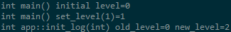
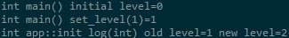

## DEEPBIND方式加载so问题简化模型

### TLDR
不要用so，不要用so，不要用so。

### 背景
有如下三个模块：当frame以DEEPBIND打开app时，不同编译方式会导致log中的static变量出现副本

1. frame：编译为bin
1. app：编译为so，由frame加载执行，
1. log：日志模块，被frame和app依赖，这个模块中定义了一个文件作用域的static变量level，并对外提供了读写这个变量的接口

### 情形1
#### 条件
1. frame以DEEPBIND方式加载libapp.so
1. frame和app分别静态链接liblog.a

#### 结果
frame和app分别能看到两个不同的level变量，在frame中先初始化level为1，但是app中看到的level变量值还是0

### 情形2
#### 条件
1. frame以DEEPBIND方式加载libapp.so
1. frame和app分别动态链接liblog.so

#### 结果
frame和app看到的level变量是一份，在frame中先初始化level为1后，app读取到的level变量值为1

### 参考
[动态链接库中的全局变量](https://zrj.me/archives/1423)

abstract：so里面的__thread变量在dlopen以后看到了两份地址。和情形1的区别是frame没有使用这个变量，所以frame没有链接so，并且也没有DEEPBIND，__thread变量不应该有两份地址。作者说是gcc4.1.2升级到4.8.2解决了这个问题。

[C++又一坑:动态链接库中的全局变量](https://blog.csdn.net/imxiangzi/article/details/45872025)

abstract：静态库a，动态库c（静态链接a），二进制b（静态链接a，动态加载c）。二进制b在进入主函数前会初始化静态库a中的全局变量，执行构造函数，载入动态链接库c时也会启动对动态库c内的全局变量进行初始化，也会执行同一个对象的构造函数。这样，一个对象就会执行两次构造函数。第二次执行构造函数的时候把全局变量的成员置空了。导致的结果是，我们的模块一开始有效，正常运行了一会会之后，就失效了。没说咋解决。
