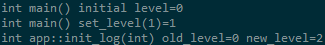
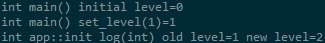

## DEEPBIND方式加载so问题简化模型

### 背景
有如下三个模块：当frame以DEEPBIND打开app时，不同编译方式会导致log中的static变量出现副本

1. frame：编译为bin
1. app：编译为so，由frame加载执行，
1. log：日志模块，被frame和app依赖，这个模块中定义了一个文件作用域的static变量level，并对外提供了读写这个变量的接口

### 情形1
#### 条件
1. frame以DEEPBIND方式加载libapp.so
1. frame和app分别静态链接liblog.a

#### 结果
frame和app分别能看到两个不同的level变量，在frame中先初始化level为1，但是app中看到的level变量值还是0

### 情形2
#### 条件
1. frame以DEEPBIND方式加载libapp.so
1. frame和app分别动态链接liblog.so

#### 结果
frame和app看到的level变量是一份，在frame中先初始化level为1后，app读取到的level变量值为1

